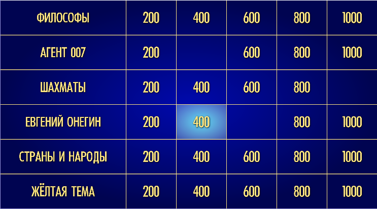

# Своя игра
Возможно вы смотрели телепередачу "Своя игра". Это телевизионная интеллектуальная игра, в которой игрокам предоставляется набор вопросов, разделенных по темам и сложности. Игроки выбирают тему, вопрос по которой хотят услышать, а затем выбирают сложность, от которой зависит количество очков, которые они могут заработать за правильный ответ.
Ниже приведена картинка, демонстрирующая поле выбора вопросов.

## Функционал
1. На главной страницы отображается поле игры с вопросами. При нажатии на вопрос всплывает модальное окно с самим вопросом и полем для ввода ответа. Кроме того игроку дается ограниченное время на то, чтобы ответить на вопрос. Если игрок не успевает - теряет очки.

2. В реализации проекта испольцеутся такой инструментом как AJAX(fetch). Соответственно, страница с игрой у нас повторно не перерисовывается. Если пользователь выбирает вопрос - появляется модальное окно. Если он отвечает на вопрос - то модальное окно пропадает, а сам вопрос либо пропадает с поля, либо как-нибудь помечается. 

3. Реализован подсчет правильных ответов и баллы, чтобы потом определять победителей. 

4. Все пути на сайте игры выглядят строго и понятно, для этого использовал CRUD с взаимодействием REST API архитектурой.

